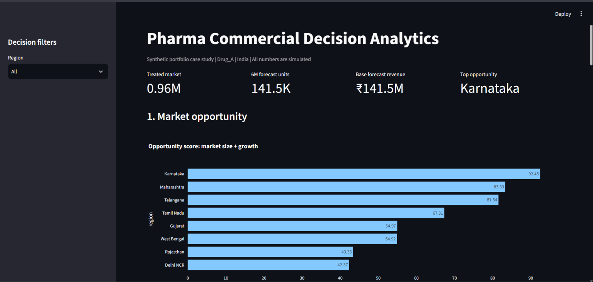
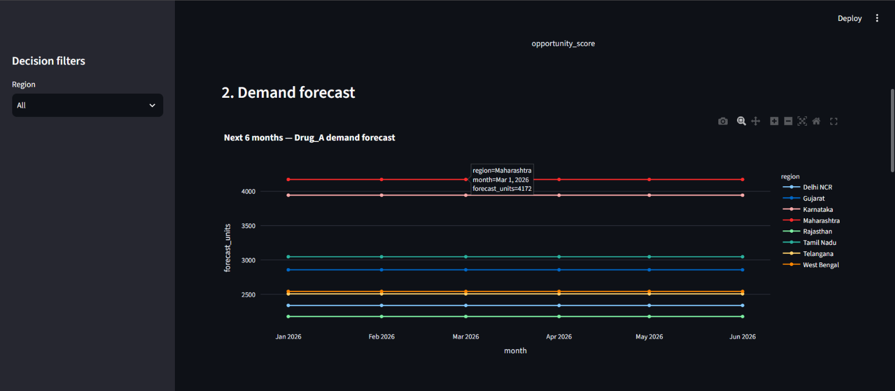
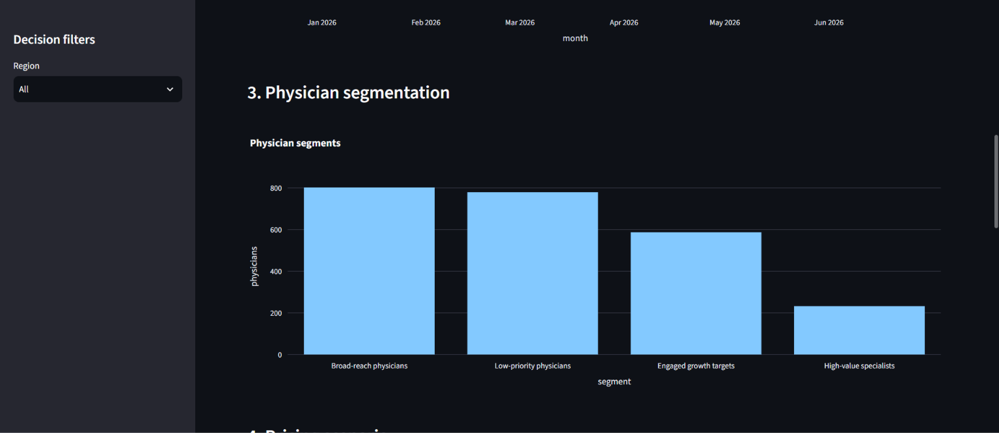
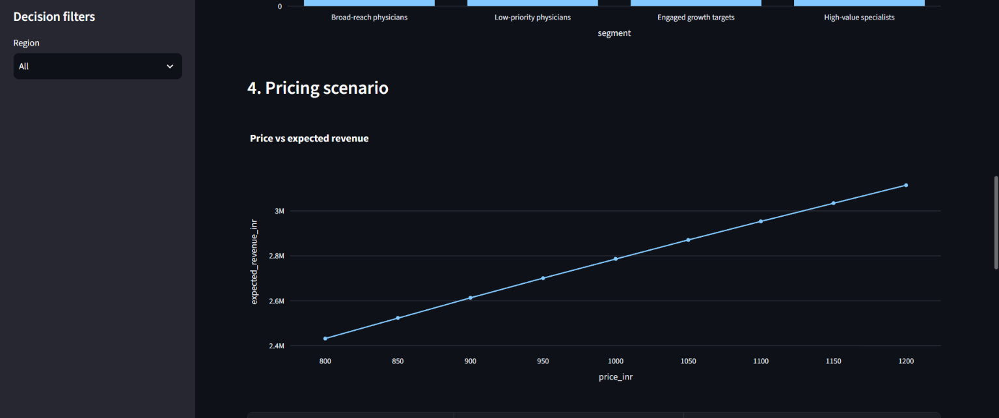
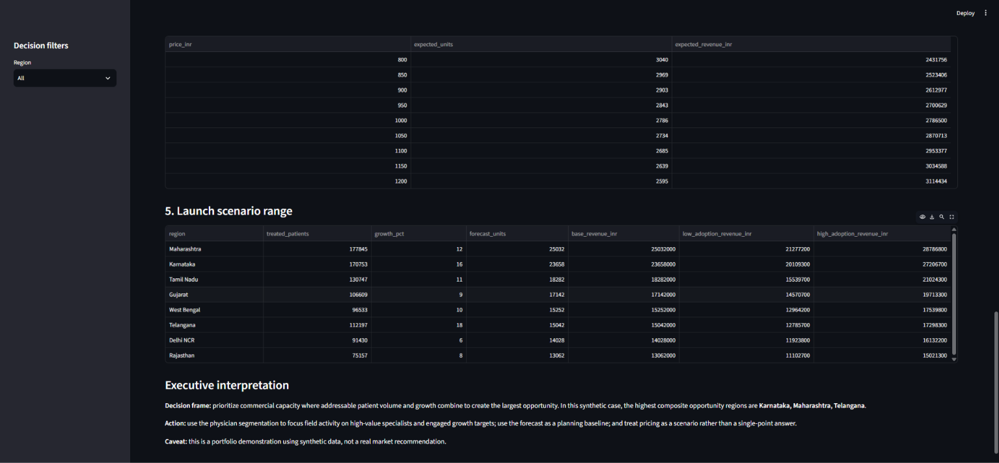

# Pharma Commercial Decision Analytics

## Executive Objective

Determine where and how a fictional pharmaceutical company should commercialize `Drug_A` for type-2 diabetes in India.

The project combines market sizing, physician segmentation, demand forecasting, pricing elasticity, scenario analysis, and executive storytelling.

> **Important:** All data are synthetic and generated deterministically. No real patients, physicians, hospitals, or confidential company data are used.

---

## Decision Analytics Case

The case is structured around a realistic commercial decision-making workflow:

**Business question → Analytical framework → Data synthesis → Modeling → Scenario analysis → Business decision**

The analysis addresses five key questions:

1. Where is the strongest market opportunity?
2. Which physician segments should be prioritized?
3. What demand can be expected over the forecast horizon?
4. How does pricing affect demand and revenue?
5. How do different market assumptions change the launch outcome?

---

## Dashboard Preview

### Executive Decision Dashboard



The dashboard brings together market opportunity, physician segmentation, demand forecasting, pricing analysis, and launch scenarios into a single decision-support view.

---

### Market Opportunity



Market-level analysis identifies regions based on patient opportunity, market growth, competitive conditions, and expected commercial potential.

---

### Physician Segmentation



Physicians are segmented using behavioral and commercial features to identify groups with different levels of patient volume, prescribing activity, and engagement.

---

### Demand Forecast



The forecasting analysis estimates future demand using historical sales patterns and the project's forecasting framework.

---

### Pricing & Scenario Analysis



Scenario analysis evaluates how changes in pricing, adoption, competition, and other assumptions affect expected demand and revenue.

---

## Key Analytical Components

### 1. Market Opportunity

Evaluates regional commercial potential using:

- Patient population
- Market growth
- Competitive intensity
- Current market characteristics
- Expected opportunity

### 2. Physician Segmentation

Uses clustering to identify physician groups based on:

- Patient volume
- Prescription activity
- Engagement
- Adoption behavior

### 3. Demand Forecasting

Forecasts future Drug_A demand using historical commercial data and evaluates forecast performance against baseline approaches.

### 4. Pricing Analysis

Analyzes the relationship between price and demand and evaluates potential revenue implications under different price points.

### 5. Scenario Analysis

Evaluates:

- Base case
- Upside case
- Downside case
- Adoption changes
- Pricing changes
- Competitive changes

The objective is to understand not only the expected outcome, but also which assumptions have the greatest impact on the decision.

---

## Executive Decision Framework

The final output converts analytical results into a business decision:

```text
Market Opportunity
        ↓
Physician Prioritization
        ↓
Demand Forecast
        ↓
Pricing Analysis
        ↓
Scenario Modeling
        ↓
Commercial Decision